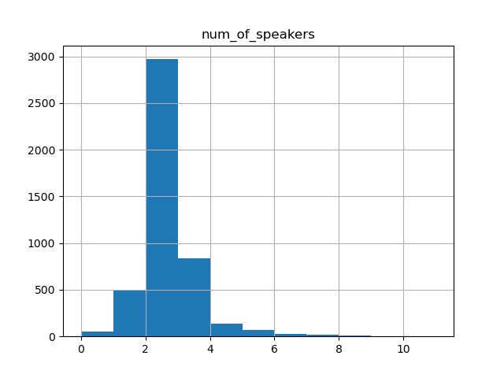
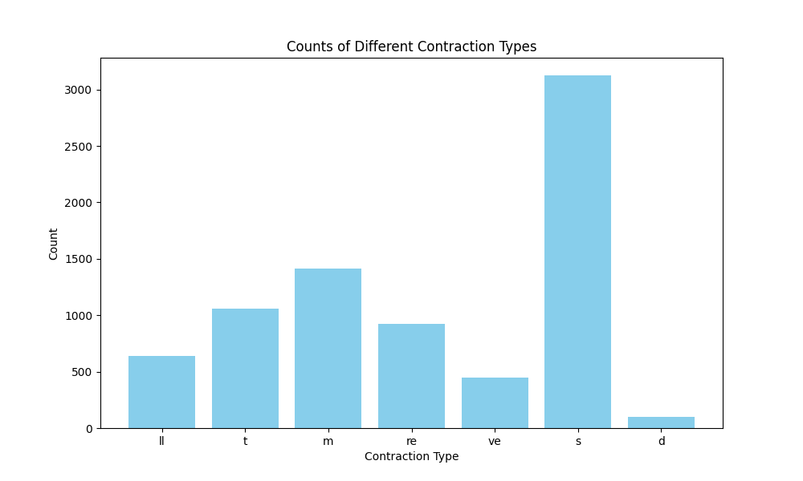
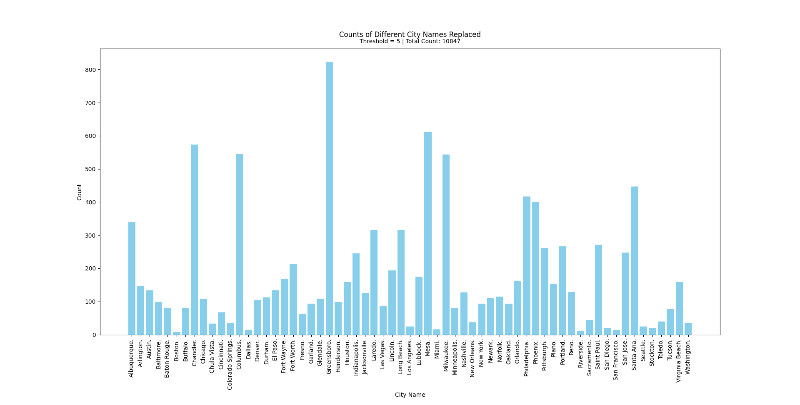
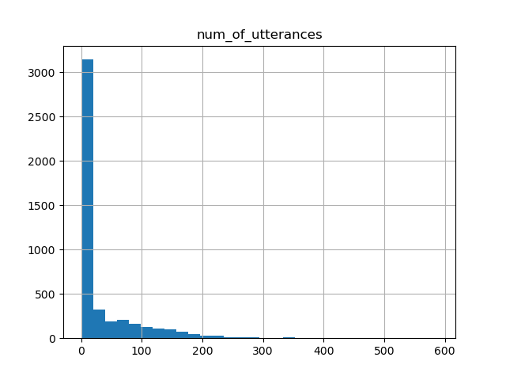
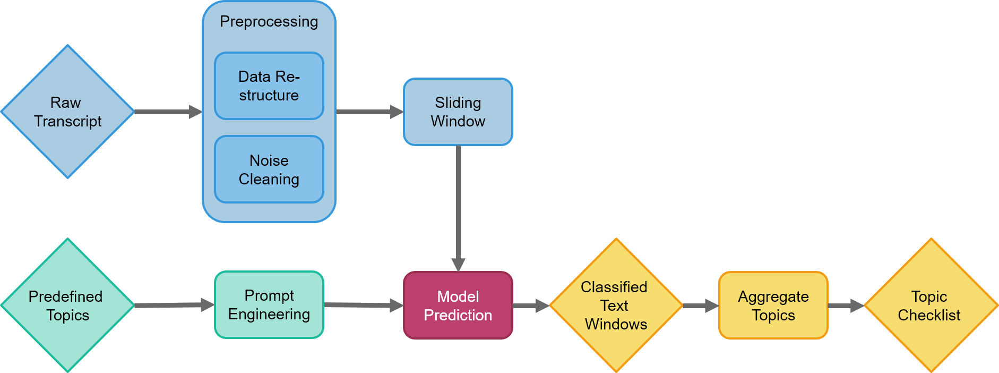
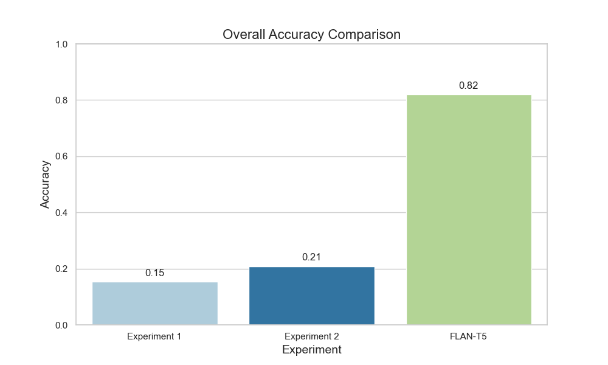
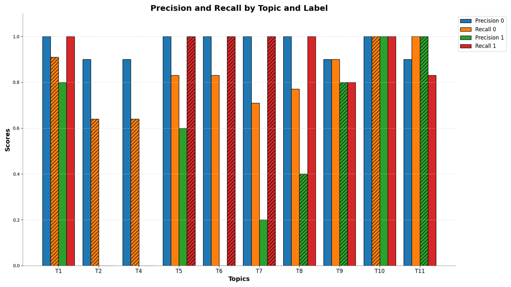
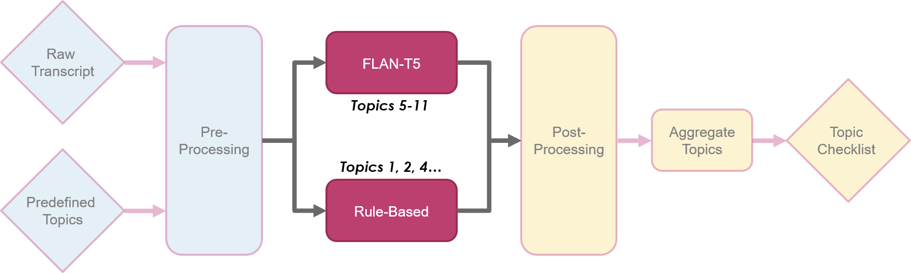

# Laguna Healthcare Conversation Analysis

## Project Overview

This project was conducted in collaboration with Laguna, a company that works with healthcare providers such as insurance companies. These providers employ care managers to assist recently discharged patients (members). The goal of this project was to analyze transcribed healthcare conversations between care managers and patients to ensure that all necessary topics, including regulatory requirements and medical plan compliance, were covered.

We applied **topic modeling** to these conversations, aiming to identify and classify important topics within each conversation segment.


### Links
- [Project Presentation](Docs/final_presentation_demoday.pdf)
- [Project Poster](src/visualization/Images/Project_Poste.png)
- [Presentation Video](https://youtu.be/M0dAMmMJz7Q)

### Note on Data Privacy
All conversations were removed from this repository to ensure compliance with HIPAA regulations, as they contain confidential information.

## Topics Covered

The conversations were analyzed to ensure they addressed the following topics:

1. Member Identification
2. Call Recording Disclosure
3. Participant Verification
4. Care Manager Introduction
5. Handling PHI (Protected Health Information)
6. TCPA Compliance
7. Sensitive Information Protocol
8. Medical Consultation Advice
9. Care Coordination
10. Log Protocol
11. Treatment Compliance and Medical State

## Challenges Faced

The project presented several unique challenges:

- **Unlabeled Data**: The conversations were not labeled, which made supervised learning techniques difficult to implement. As a result, we had to conduct some manual labeling.
- **Conversational Nature of the Data**: The transcribed conversations were not continuous texts, which most language models are typically trained on. Interruptions, hesitations, and small talk made the task more complex.
- **Noise in the Data**: The conversations were transcribed, often introducing noise through unclear speech, background sounds, or transcription errors. Additionally, the de-identification process injected various disruptions, such as replacing stop words with random names or city names, further complicating the analysis.

## Data Overview

### Raw Data Structure

The original dataset consisted of **4606 JSON files**, each representing a transcribed conversation. The filename structure was `[patient_id]_[recording_id]`. Each JSON file contained:

- **Speaker**: Automatically allocated, though occasionally erroneous.
- **Time**: The timestamp marking the start of the current utterance relative to the beginning of the call.
- **Text**: The content of the utterance.
- **ID**: A unique identifier for each utterance.

**Example JSON structure**:

```json
{
   "transcript": [
       {
           "speaker": "speakerA",
           "time": 0,
           "text": "Hello?",
           "id": "714658d8-db03-4ce2-8b1d-be44b52d1720"
       }
   ]
}
```

## Exploratory Data Analysis (EDA)

### Word Frequency Analysis

We performed a detailed **Exploratory Data Analysis (EDA)** to identify patterns in the data and improve the model's focus by removing noisy or irrelevant text. The following n-gram frequency graphs provided insight into the most common phrases in the conversations.

#### Top-10 Frequent Terms (n-grams) per Topic

We conducted an analysis of the most frequent terms for each topic identified in the manually tagged data. Below are the n-grams for selected topics:

- **Topic 1: Member Identification**

  - Top 1-grams: Address, date, name, birth, confirm, please, full, could, verify, olivia
  - Top 2-grams: Date birth, name address, full name, birth date, confirm name
  - Top 3-grams: Name date birth, date birth address, confirm name date

- **Topic 11: Treatment Compliance and Medical State**

  - Top 1-grams: Treatment, let, medication, amelia, review, discuss, ensure, medical, need
  - Top 2-grams: Let review, treatment plan, medical state, ensure you're, side effect
  - Top 3-grams: Olivia let review, review medication you're, medication you're currently, taking discuss issue, treatment plan ensure

### Number of Speakers Analysis

During the initial analysis, we observed that many conversations contained an unusually high number of speakers, sometimes more than 8 or 9 speakers. This was clearly erroneous, as it did not align with the expected format of healthcare conversations between patients and care managers. These errors were likely introduced by the automated speaker allocation process, and we had to manually review and correct such cases.



### Noise Reduction Strategy

We identified common words and n-grams that produced significant noise. By focusing on more meaningful and informative words, the model's performance was improved. Words like **"know," "like," "yeah," "okay,"** and **"good"** were removed.

Additionally, we identified de-identification artifacts in the data, such as **apostrophes replaced by names** (e.g., "itD O M I N G E Zs"), which we fixed using a custom function to replace these patterns with appropriate apostrophes. 




Another artifact involved city names being replaced for generic terms (e.g., "OK" replaced by various U.S. city names). Using a list of U.S. city names, we applied a threshold-based strategy to replace these mentions back to (presumed) original term.


### Conversation Lengths and Utterances Analysis

We analyzed the distribution of **conversation lengths** to identify and remove noisy or irrelevant conversations.

- **Observation**: Many conversations were very short, likely representing garbage data. Conversations with fewer than 11 utterances were excluded.



## Models and Approaches Used

### FLAN-T5-LARGE Model

Our main solution was based on the **FLAN-T5-LARGE** model, which was selected for its versatility in handling multiple NLP tasks such as classification and question answering.

- **Preprocessing**: We restructured and cleaned the data to help the model understand the conversational context better.
- **Sliding Window Approach**: Conversations were split into smaller overlapping windows, allowing the model to retain context across the conversation.
- **Prompt Engineering**: We provided the model with a list of predefined topics, each assigned its own prompt. The model responded with a `1` (topic identified), `0` (topic not identified), or `-9` (uncertain) for each window.




### Rule-Based Model

To complement the LLM, we implemented a **rule-based model** that used keywords and TF-IDF scores to determine the presence of topics in a conversation window.

### Data Augmentation

Before applying TF-IDF and word embeddings to enrich the rule-based keywords, we used data augmentation with ChatGPT. The augmentation process involved generating new utterances with labeled topics based on selected, manually tagged existing utterances. This allowed us to expand the dataset and improve the robustness of the keyword-based rule model.

### TF-IDF and Keyword Enrichment

We used **TF-IDF** to vectorize words in each topic, identifying the top 10 words for each topic. This helped characterize the conversations more precisely and allowed for better identification of relevant segments. Additionally, we used **word embeddings** to find similar words to the top-n words of each topic, thereby enriching the vocabulary and enhancing the model's ability to detect relevant content.

## Evaluation

### Evaluation of Rule-Based Model (RB)

#### Experiment 1&#x20;

- **Procedure**: We used a manual tagging process to evaluate the accuracy of predictions generated by our rule-based classifier, resulting in an accuracy of **47%** ("no_topic" taken into account).
- **Accuracy by Topic**: Varied significantly, with some topics achieving **58% accuracy** while others fell to **0%**.

#### Experiment 2&#x20;

- **Modifications and Enhancements**: Adjustments to keyword lists and the addition of more specific classification rules led to improved performance.
- **Results**: Total accuracy improved to **67.69%** ("no_topic" taken into account), with notable gains in certain combined topics.


### Model Comparison: Rule-Based vs. FLAN-T5

- **Rule-Based Model**:
  - Accuracy (Exp 1): 15% without "no_topic".
  - Accuracy (Exp 2): 21% without "no_topic".
- **FLAN-T5 Model**:
  - Total Accuracy: **82%**.


### Precision and Recall per Topic Analysis

For each topic, we conducted an analysis of precision and recall on both labels 1 and 0. We determined that, for each topic, one of these four scores is the most relevant, and improving that score should be prioritized in the model. This determination was based on domain knowledge and reflected the specific importance of either coverage or exclusion for each topic.

To demonstrate the approach, we selected the most relevant score for two topics. This analysis should ideally be performed for all topics, serving as a basis for targeted model improvements. The goal would be to modify the model to specifically improve the performance on the most relevant score for each topic.



 

### Future Directions

- **Optimization**: Fine-tune the FLAN model for specific conversational contexts and improve the rule-based keyword strategy.
- **Hybrid Solution**: Explore the integration of both rule-based and FLAN approaches to leverage the strengths of each model for better overall performance.



___

### Acknowledgments
This project was a collaborative effort involving multiple contributors. I would like to extend my sincere thanks to my colleagues Leehee Barak, Adir Golan, and our mentor Dina Bavli for their invaluable contributions throughout the project. Additionally, a big thank you to the Laguna team for their support and feedback during the development process.